# Entity Relationship Diagram (ERD)

## Overview

This document provides comprehensive Entity Relationship Diagrams for the SEKAR database schema, reflecting Phase 1–5 implementation including the 8-role system (ADR-009), terminology cleanup (ADR-010), monitoring v2 (ADR-029), plants management (ADR-030), typed tasks (ADR-031), and reporting/analytics/assets modules (ADRs 024–026).

**Notation:**
- `1` = One (exactly one)
- `inf` = Many (zero or more)
- `1..1` = One-to-One
- `1..inf` = One-to-Many
- `||` = Mandatory (NOT NULL)
- `o|` = Optional (NULL allowed)

**Authority:**
- **Current ERD:** below (conceptual model for Phase 2C–5)
- **Actual schema:** see `schema.md` + migrations in `apps/be/src/database/migrations/`
- **Live database:** reflect `specs/COMPLETION_STATUS.md` (Phase 5 complete, tables include all Phase 3–5 additions)

---

## Complete ERD (All Tables -- Phase 2C Post-Rewrite)

```mermaid
erDiagram
    RAYONS ||--o{ LOCATIONS : "contains"
    RAYONS ||--o{ USERS : "manages"
    RAYONS ||--o{ TASKS : "scoped_to"

    USERS ||--o{ SCHEDULES : "scheduled"
    USERS ||--o{ SHIFTS : "works"
    USERS ||--o{ ACTIVITIES : "creates"
    USERS ||--o{ LOCATION_LOGS : "sends"
    USERS ||--o{ TASKS : "assigned_to"
    USERS ||--o{ TASKS : "created_by"
    USERS ||--o{ TASK_TAGS : "tagged_in"
    USERS ||--o{ OVERTIMES : "submits"
    USERS ||--o{ NOTIFICATIONS : "receives"

    LOCATION_TYPES ||--o{ LOCATIONS : "categorizes"

    LOCATIONS ||--o{ SCHEDULES : "scheduled_at"
    LOCATIONS ||--o{ SHIFTS : "location_for"
    LOCATIONS ||--o{ ACTIVITIES : "activity_at"
    LOCATIONS ||--o{ TASKS : "scoped_to"
    LOCATIONS ||--o{ OVERTIMES : "overtime_at"
    LOCATIONS ||--o{ LOCATION_STAFF_REQUIREMENTS : "requires"
    LOCATIONS o|--|| USERS : "korlap_location"

    SHIFTS ||--o{ ACTIVITIES : "contains"
    SHIFTS ||--o{ LOCATION_LOGS : "tracks"

    SHIFT_DEFINITIONS ||--o{ SCHEDULES : "defines"
    SHIFT_DEFINITIONS ||--o{ LOCATION_STAFF_REQUIREMENTS : "for_shift"

    TASKS ||--o{ TASK_TAGS : "has_tags"

    ACTIVITY_TYPES ||--o{ ACTIVITIES : "categorizes"
    ACTIVITY_TYPES ||--o{ OVERTIMES : "categorizes"

    USERS {
        uuid id PK
        varchar username UK "NOT NULL, UNIQUE"
        varchar password_hash "NOT NULL"
        varchar full_name "NOT NULL"
        varchar phone "NULL"
        varchar role "NOT NULL, 8-role enum"
        uuid rayon_id FK "NULL, for kepala_rayon"
        uuid location_id FK "NULL, for korlap"
        boolean is_active "DEFAULT true"
        timestamptz created_at
        timestamptz updated_at
        timestamptz deleted_at "NULL, soft delete"
    }

    RAYONS {
        uuid id PK
        varchar name UK "NOT NULL"
        varchar code UK "NOT NULL"
        text description "NULL"
        timestamptz created_at
        timestamptz updated_at
    }

    LOCATION_TYPES {
        uuid id PK
        varchar code UK "NOT NULL"
        varchar name "NOT NULL"
        text description "NULL"
        varchar category "ACTIVE or PASSIVE"
        timestamptz created_at
        timestamptz updated_at
        timestamptz deleted_at "NULL"
    }

    LOCATIONS {
        uuid id PK
        varchar name "NOT NULL"
        uuid location_type_id FK "NOT NULL"
        uuid rayon_id FK "NULL"
        decimal gps_lat "NOT NULL"
        decimal gps_lng "NOT NULL"
        integer radius_meters "DEFAULT 100"
        text address "NULL"
        jsonb boundary_polygon "NULL, GeoJSON for polygon geofencing"
        decimal coverage_area "NULL"
        boolean is_active "DEFAULT true"
        timestamptz created_at
        timestamptz updated_at
        timestamptz deleted_at "NULL"
    }

    SCHEDULES {
        uuid id PK
        uuid user_id FK "NOT NULL"
        uuid location_id FK "NOT NULL"
        uuid shift_definition_id FK "NOT NULL"
        date effective_date "NOT NULL"
        date end_date "NULL"
        uuid created_by FK "NULL"
        timestamptz created_at
        timestamptz updated_at
    }

    SHIFT_DEFINITIONS {
        uuid id PK
        varchar name UK "NOT NULL"
        varchar code UK "NOT NULL"
        time start_time "NOT NULL"
        time end_time "NOT NULL"
        boolean crosses_midnight "DEFAULT false"
        boolean is_active "DEFAULT true"
        timestamptz created_at
        timestamptz updated_at
    }

    SHIFTS {
        uuid id PK
        uuid user_id FK "NOT NULL, renamed from worker_id"
        uuid location_id FK "NULL, auto-detected"
        timestamptz clock_in_time "NOT NULL"
        decimal clock_in_gps_lat "NULL"
        decimal clock_in_gps_lng "NULL"
        text clock_in_photo_url "NULL"
        boolean clock_in_outside_boundary "DEFAULT false"
        timestamptz clock_out_time "NULL"
        decimal clock_out_gps_lat "NULL"
        decimal clock_out_gps_lng "NULL"
        text clock_out_photo_url "NULL"
        boolean clock_out_outside_boundary "DEFAULT false"
        timestamptz created_at
        timestamptz updated_at
        timestamptz deleted_at "NULL"
    }

    ACTIVITIES {
        uuid id PK
        uuid user_id FK "NOT NULL, renamed from worker_id"
        uuid shift_id FK "NOT NULL"
        uuid location_id FK "NULL"
        uuid task_id FK "NULL"
        uuid activity_type_id FK "NULL"
        text description "NOT NULL"
        text_array photo_urls "NOT NULL, 1-3 URLs"
        decimal gps_lat "NULL"
        decimal gps_lng "NULL"
        timestamptz created_at
        timestamptz updated_at
        timestamptz deleted_at "NULL"
    }

    ACTIVITY_TYPES {
        uuid id PK
        varchar name "NOT NULL"
        varchar code UK "NOT NULL"
        text description "NULL"
        text_array applicable_roles "NOT NULL, lowercase values"
        boolean is_active "DEFAULT true"
        timestamptz created_at
        timestamptz updated_at
    }

    TASKS {
        uuid id PK
        varchar title "NOT NULL"
        text description "NULL"
        varchar status "pending/assigned/in_progress/completed"
        varchar priority "low/medium/high/urgent"
        timestamptz deadline "NULL"
        uuid location_id FK "NULL"
        uuid rayon_id FK "NULL"
        uuid assigned_to FK "NULL"
        uuid created_by FK "NOT NULL"
        varchar completion_photo_url "NULL"
        text completion_notes "NULL"
        timestamptz completed_at "NULL"
        timestamptz assigned_at "NULL"
        timestamptz started_at "NULL"
        timestamptz created_at
        timestamptz updated_at
        timestamptz deleted_at "NULL"
    }

    TASK_TAGS {
        uuid id PK
        uuid task_id FK "NOT NULL"
        uuid user_id FK "NOT NULL"
        timestamptz created_at
    }

    OVERTIMES {
        uuid id PK
        uuid user_id FK "NOT NULL"
        uuid location_id FK "NULL"
        timestamptz start_datetime "NOT NULL"
        timestamptz end_datetime "NOT NULL"
        varchar status "pending/approved/rejected"
        uuid approved_by FK "NULL"
        timestamptz approved_at "NULL"
        text rejection_reason "NULL"
        uuid activity_type_id FK "NULL, SET NULL on delete"
        text description "NULL"
        text_array photo_urls "DEFAULT empty array, 1-3 URLs"
        decimal gps_lat "NULL"
        decimal gps_lng "NULL"
        timestamptz created_at
        timestamptz updated_at
    }

    LOCATION_LOGS {
        uuid id PK
        uuid user_id FK "NOT NULL, renamed from worker_id"
        uuid shift_id FK "NOT NULL"
        decimal gps_lat "NOT NULL"
        decimal gps_lng "NOT NULL"
        decimal accuracy_meters "NULL"
        integer battery_level "NULL"
        timestamptz logged_at "NOT NULL"
    }

    LOCATION_STAFF_REQUIREMENTS {
        uuid id PK
        uuid location_id FK "NOT NULL"
        uuid shift_definition_id FK "NOT NULL"
        varchar role "NOT NULL"
        integer required_count "DEFAULT 1"
        varchar day_type "WEEKDAY/WEEKEND/HOLIDAY"
        timestamptz created_at
        timestamptz updated_at
    }

    NOTIFICATIONS {
        uuid id PK
        uuid user_id FK "NOT NULL"
        varchar title "NOT NULL"
        text body "NOT NULL"
        varchar type "NOT NULL"
        jsonb data "NULL"
        timestamptz read_at "NULL"
        timestamptz sent_at
        timestamptz created_at
    }

    NOTIFICATION_TOKENS {
        uuid id PK
        uuid user_id FK "NOT NULL"
        text token "NOT NULL"
        varchar platform "NOT NULL"
        varchar device_id "NULL"
        timestamptz created_at
        timestamptz updated_at
    }

    SPECIAL_DAY_OVERRIDES {
        uuid id PK
        date date UK "NOT NULL"
        varchar day_type "NOT NULL"
        varchar name "NULL"
        text description "NULL"
        timestamptz created_at
        timestamptz updated_at
    }
```

---

## Role System (Phase 2C -- 8 Roles)

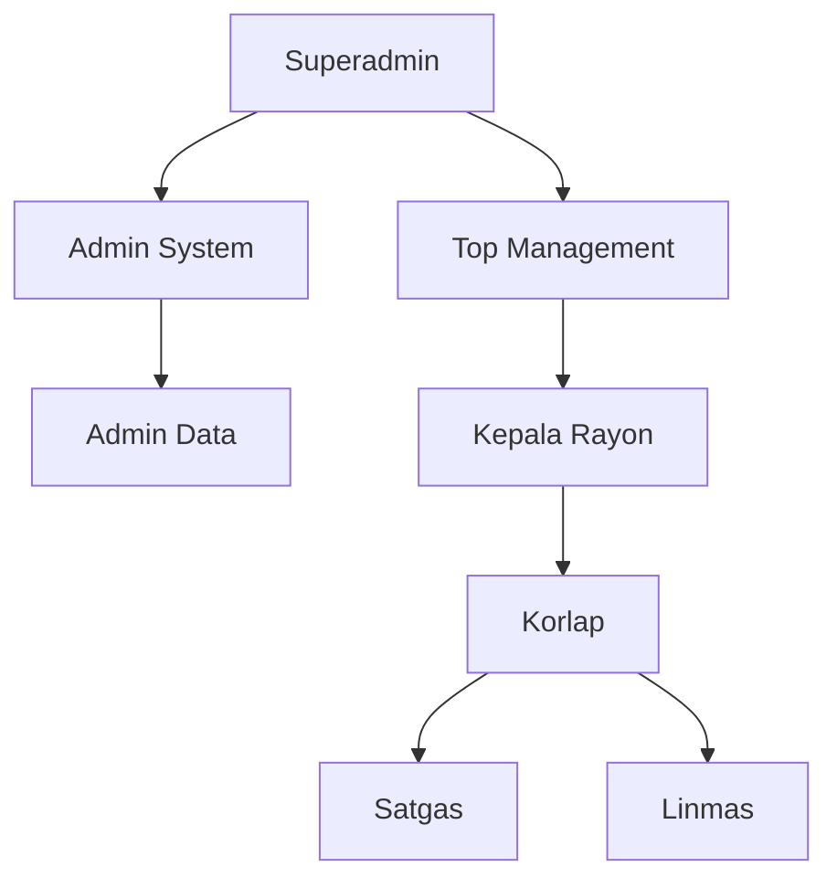

| Role | Enum Value | Scope | Description |
|------|-----------|-------|-------------|
| Superadmin | `superadmin` | System-wide | Full system access |
| Admin System | `admin_system` | System-wide | System administration |
| Admin Data | `admin_data` | System-wide | Data management |
| Top Management | `top_management` | City-wide | City-wide dashboards |
| Kepala Rayon | `kepala_rayon` | 1 Rayon | Rayon management (via rayon_id) |
| Korlap | `korlap` | 1 Location | Location coordination (via location_id) |
| Satgas | `satgas` | Assigned area | Field worker |
| Linmas | `linmas` | Assigned area | Security officer |

---

## Core Relationships

### User Assignments

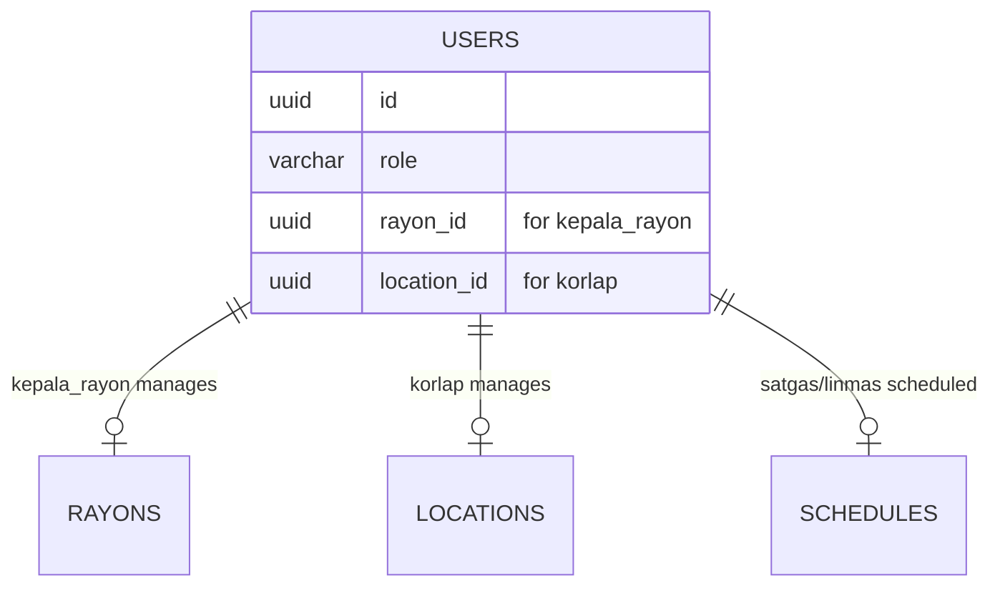

**Assignment Rules:**
- **kepala_rayon** -> assigned via `users.rayon_id`
- **korlap** -> assigned via `users.location_id`
- **satgas/linmas** -> assigned via `schedules` (effective_date/end_date range)
- **worker_assignments** -> DROPPED (fully replaced by schedules)

---

### Task Workflow

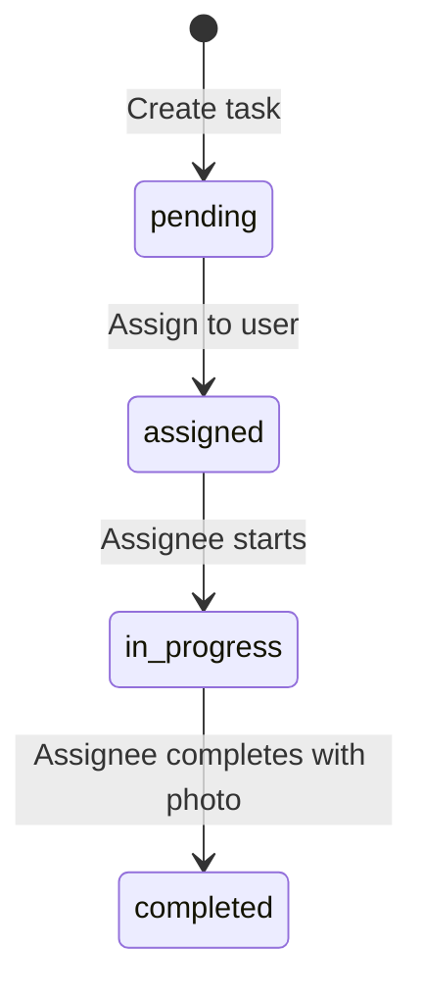

**Task Relationships:**
- Task -> Location (nullable for rayon-scoped)
- Task -> Rayon (nullable for location-scoped)
- Task -> User (assigned_to, created_by)
- Task -> TaskTag (1:inf, CC-like tagging)

---

### Overtime Workflow (Flat -- 1 overtime = 1 activity)

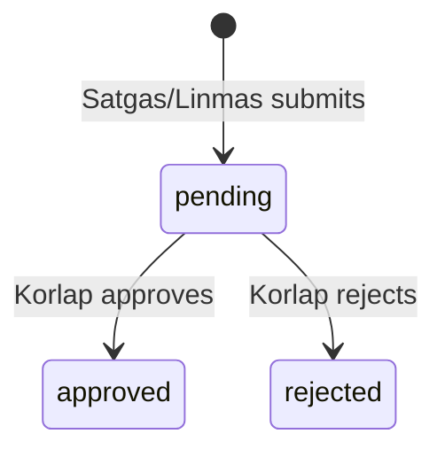

**Overtime Relationships (Post-Rewrite):**
- Overtime -> User (submitter, CASCADE)
- Overtime -> Location (nullable, SET NULL)
- Overtime -> User (approver, nullable)
- Overtime -> ActivityType (ManyToOne, SET NULL) -- flat, inline on overtimes table
- No child table (overtime_aktivitas DROPPED)

---

### Shift & Activities Flow

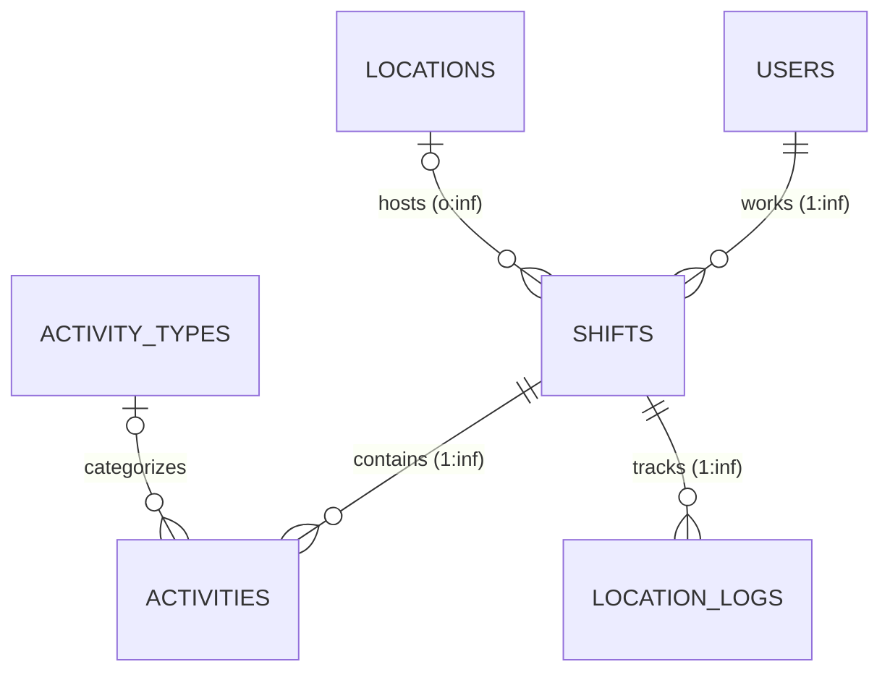

**Phase 2C Changes:**
- `shifts.user_id` renamed from `worker_id`
- `shifts.clock_in_outside_boundary` and `clock_out_outside_boundary` added (polygon geofencing flags)
- `shifts.location_id` is **nullable** (auto-detected from Schedule)
- `activities` table renamed from `work_reports`
- `activities.user_id` renamed from `worker_id`
- `activities.photo_urls` TEXT[] (1-3 photos)
- `activities.gps_lat/gps_lng` are **nullable**
- `activities.activity_type_id` links to `activity_types` for role-based validation
- `activities.report_type` column DROPPED

---

## Cardinality Summary Table

| Relationship | Parent | Child | Type | Constraint | Notes |
|-------------|--------|-------|------|------------|-------|
| Rayon-Location | rayons | locations | 1:inf | FK(rayon_id) | 7 rayons, many locations each |
| Rayon-User | rayons | users | 1:inf | FK(rayon_id) | kepala_rayon role |
| Rayon-Task | rayons | tasks | 1:inf | FK(rayon_id) | Rayon-scoped tasks |
| LocationType-Location | location_types | locations | 1:inf | FK(location_type_id) | ACTIVE/PASSIVE category |
| Location-User | locations | users | 1:inf | FK(location_id) | korlap role |
| User-Schedule | users | schedules | 1:inf | FK(user_id) | Primary assignment |
| Location-Schedule | locations | schedules | 1:inf | FK(location_id) | Schedule location |
| ShiftDef-Schedule | shift_definitions | schedules | 1:inf | FK(shift_definition_id) | Schedule timing |
| User-Shift | users | shifts | 1:inf | FK(user_id) | Work shifts |
| Location-Shift | locations | shifts | o:inf | FK(location_id) | Nullable |
| Shift-Activity | shifts | activities | 1:inf | FK(shift_id) | Activity reports |
| Shift-Location | shifts | location_logs | 1:inf | FK(shift_id) | GPS tracking |
| User-Activity | users | activities | 1:inf | FK(user_id) | Activity submitter |
| ActivityType-Activity | activity_types | activities | o:inf | FK(activity_type_id) | Role-validated |
| Task-Activity | tasks | activities | o:inf | FK(task_id) | Task completion |
| User-Task (assigned) | users | tasks | o:inf | FK(assigned_to) | Assignment |
| User-Task (created) | users | tasks | 1:inf | FK(created_by) | Creator |
| Location-Task | locations | tasks | o:inf | FK(location_id) | Nullable for rayon-scoped |
| Task-TaskTag | tasks | task_tags | 1:inf | FK(task_id) CASCADE | CC-like tagging |
| User-TaskTag | users | task_tags | 1:inf | FK(user_id) CASCADE | Tagged users |
| User-Overtime | users | overtimes | 1:inf | FK(user_id) CASCADE | Submissions |
| Location-Overtime | locations | overtimes | o:inf | FK(location_id) SET NULL | Location |
| ActivityType-Overtime | activity_types | overtimes | o:inf | FK(activity_type_id) SET NULL | Flat activity |
| User-Notification | users | notifications | 1:inf | FK(user_id) CASCADE | Alerts |
| User-NotifToken | users | notification_tokens | 1:inf | FK(user_id) CASCADE | Devices |
| ShiftDef-StaffReq | shift_definitions | location_staff_requirements | 1:inf | FK(shift_definition_id) | Requirements |
| Location-StaffReq | locations | location_staff_requirements | 1:inf | FK(location_id) CASCADE | Requirements |

---

## Foreign Key Cascade Rules

| FK | ON DELETE | Rationale |
|----|----------|-----------|
| users.rayon_id | SET NULL | User persists if rayon deleted |
| users.location_id | SET NULL | User persists if location deleted |
| schedules.user_id | CASCADE | Remove schedules when user deleted |
| schedules.location_id | CASCADE | Remove schedules when location deleted |
| shifts.user_id | RESTRICT | Preserve shift history |
| shifts.location_id | RESTRICT | Preserve shift history |
| activities.user_id | RESTRICT | Preserve activity history |
| activities.shift_id | RESTRICT | Preserve activity history |
| activities.task_id | SET NULL | Activity persists if task deleted |
| activities.activity_type_id | SET NULL | Activity persists if type deleted |
| tasks.assigned_to | SET NULL | Task persists if user deleted |
| tasks.created_by | RESTRICT | Preserve creator reference |
| tasks.location_id | RESTRICT | Prevent deletion of location with tasks |
| task_tags.task_id | CASCADE | Remove tags when task deleted |
| task_tags.user_id | CASCADE | Remove tags when user deleted |
| overtimes.user_id | CASCADE | Remove overtime when user deleted |
| overtimes.location_id | SET NULL | Overtime persists if location deleted |
| overtimes.activity_type_id | SET NULL | Overtime persists if type deleted |
| notifications.user_id | CASCADE | Remove notifications when user deleted |
| notification_tokens.user_id | CASCADE | Remove tokens when user deleted |

---

## Unique Constraints

| Table | Constraint | Columns |
|-------|-----------|---------|
| users | uq_users_username | username (WHERE deleted_at IS NULL) |
| rayons | uq_rayons_name | name |
| rayons | uq_rayons_code | code |
| location_types | uq_location_types_code | code |
| shift_definitions | uq_shift_definitions_code | code |
| shift_definitions | uq_shift_definitions_name | name |
| activity_types | uq_activity_types_code | code |
| schedules | uq_schedule_overlap | (user_id, effective_date, shift_definition_id) |
| task_tags | uq_task_tags_task_user | (task_id, user_id) |
| notification_tokens | uq_notification_tokens_user_token | (user_id, token) |
| special_day_overrides | uq_special_day_date | date |
| location_staff_requirements | uq_location_staff_requirements | (location_id, shift_definition_id, role, day_type) |

---

## Check Constraints

```sql
-- users.role (Phase 2C: 8 roles)
CHECK (role IN ('satgas', 'linmas', 'korlap', 'admin_data',
                'kepala_rayon', 'top_management', 'admin_system', 'superadmin'))

-- tasks.status (Phase 2C: 4 statuses, simplified from 6)
CHECK (status IN ('pending', 'assigned', 'in_progress', 'completed'))

-- tasks.priority
CHECK (priority IN ('low', 'medium', 'high', 'urgent'))

-- overtimes.status
CHECK (status IN ('pending', 'approved', 'rejected'))

-- location_types.category
CHECK (category IN ('ACTIVE', 'PASSIVE'))

-- location_staff_requirements.day_type
CHECK (day_type IN ('WEEKDAY', 'WEEKEND', 'HOLIDAY'))

-- GPS coordinates
CHECK (gps_lat BETWEEN -90 AND 90)
CHECK (gps_lng BETWEEN -180 AND 180)

-- battery_level
CHECK (battery_level BETWEEN 0 AND 100)
```

---

## Data Flow Examples

### Clock-In Flow (Phase 2C -- Soft Polygon Geofencing)

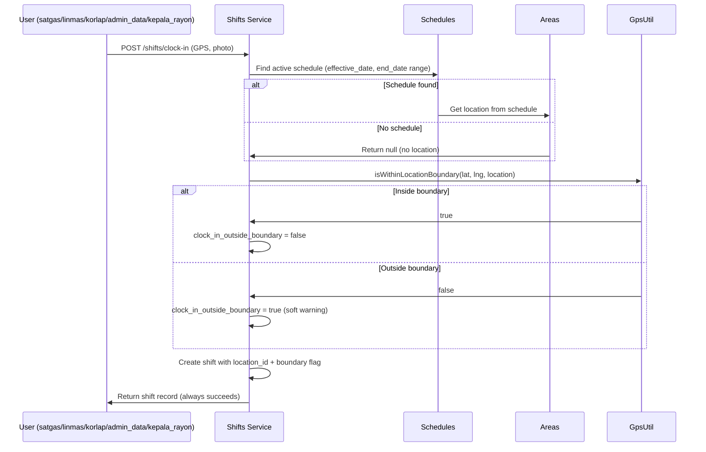

### Activity Submission Flow (Phase 2C)

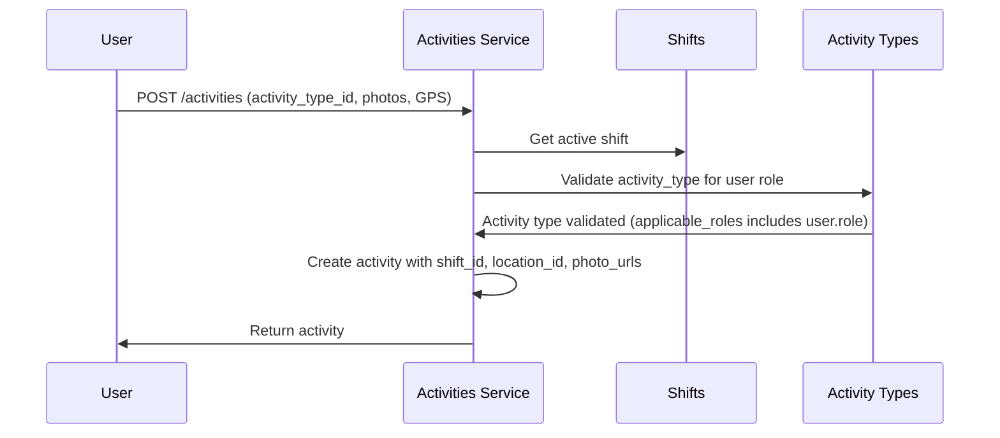

### Overtime Submission Flow (Flat)

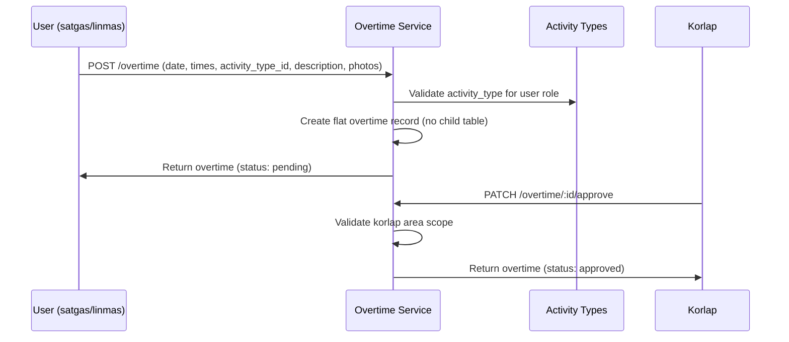

---

## Tables Dropped in Phase 2C (ADR-010)

| Table | Reason | Replacement |
|-------|--------|-------------|
| `worker_assignments` | Fully replaced by `schedules` | `schedules` table |
| `overtime_aktivitas` | Merged into `overtimes` (flat 1:1) | Activity columns on `overtimes` |

---

## Table Count Summary

| Phase | Tables | New/Changed in Phase |
|-------|--------|---------------------|
| Phase 1 (Core) | 7 | users, area_types, areas, worker_assignments, shifts, work_reports, location_logs |
| Phase 2A (Rayons) | 5 | rayons, shift_definitions, worker_schedules, area_staff_requirements, special_day_overrides |
| Phase 2B (Tasks) | 3 | tasks, notifications, notification_tokens |
| Phase 2C (Feedback) | -2 +1 | +task_tags, +overtimes; DROPPED: worker_assignments, overtime_aktivitas; RENAMED: worker_schedules->schedules, work_reports->activities |
| Phase 2D (Monitoring) | +2 | +user_tracking_status, +monitoring_configs |
| **Total** | **20** | 17 from Phase 2C + 2 from Phase 2D + 1 net adjustment |

---

---

## Phase 2E: Planned ERD Changes (Client Feedback II)

> **Full specification:** See [build history](../history/CHANGELOG.md)

### New Entities

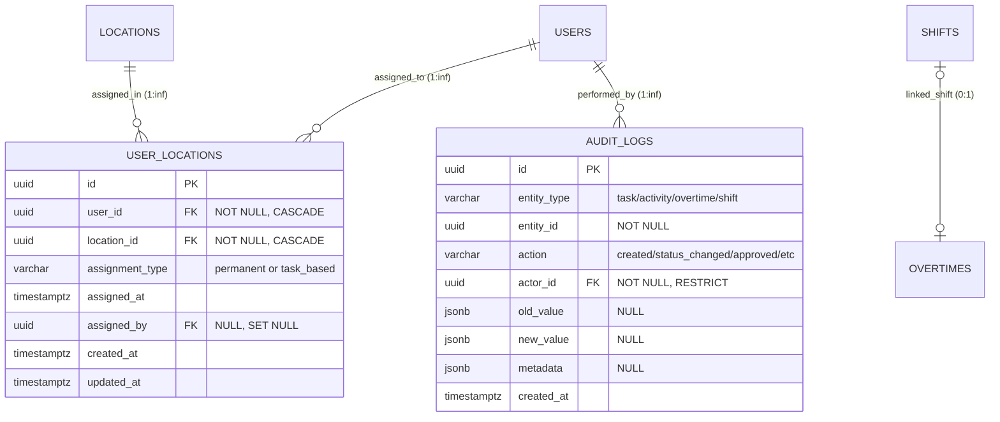

### Modified Entities (Phase 2E)

| Entity | New Columns | Changes |
|--------|-------------|---------|
| USERS | `phone_number` VARCHAR(20) UNIQUE NULL, `profile_picture_url` TEXT NULL | New `user_locations` relation |
| SHIFTS | `is_overtime` BOOLEAN DEFAULT false | Links to overtimes via FK |
| OVERTIMES | `shift_id` UUID FK→shifts NULL | Status enum adds 'in_progress' |
| USER_TRACKING_STATUS | `rayon_id` UUID FK→rayons NULL | Rayon-level tracking for admin_data/kepala_rayon |

### Updated Role Assignments (Phase 2E)

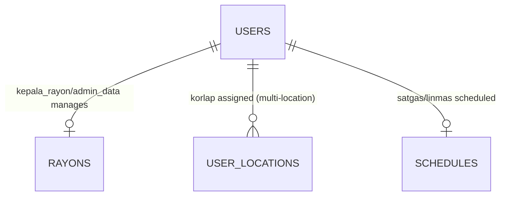

**Assignment Rules (Phase 2E):**
- **kepala_rayon** → assigned via `users.rayon_id`
- **admin_data** → assigned via `users.rayon_id` (same as kepala_rayon)
- **korlap** → assigned via `user_locations` (permanent, multiple locations in 1 rayon); `users.location_id` kept for backward compat
- **satgas/linmas** → permanent via `schedules` + dynamic `user_locations` (task_based) from active tasks

### Updated Overtime Workflow (Phase 2E — Clock-In/Out Based)

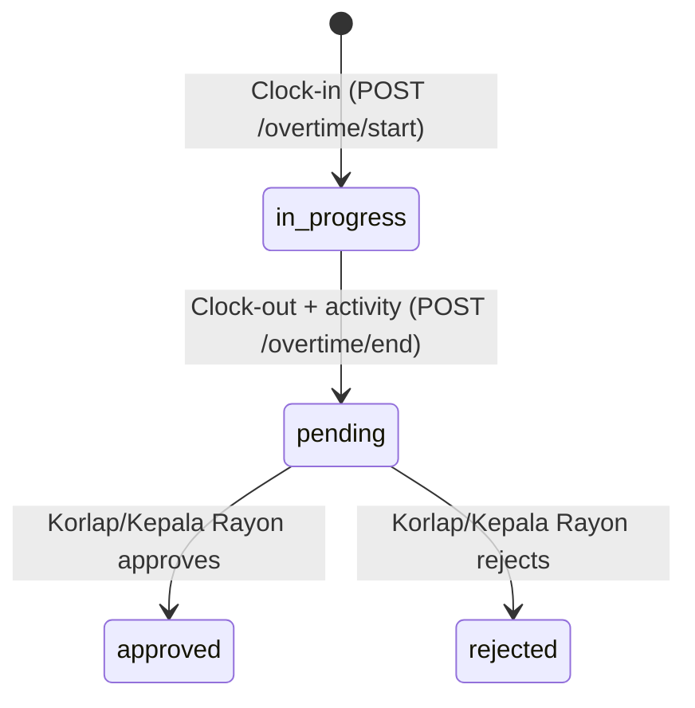

### Cardinality Additions (Phase 2E)

| Relationship | Parent | Child | Type | Constraint | Notes |
|-------------|--------|-------|------|------------|-------|
| User-UserLocation | users | user_locations | 1:inf | FK(user_id) CASCADE | Multi-location assignment |
| Location-UserLocation | locations | user_locations | 1:inf | FK(location_id) CASCADE | Location assignment |
| User-AuditLog | users | audit_logs | 1:inf | FK(actor_id) RESTRICT | Audit actor |
| Shift-Overtime | shifts | overtimes | 0:1 | FK(shift_id) SET NULL | Overtime shift link |
| Rayon-TrackingStatus | rayons | user_tracking_status | 1:inf | FK(rayon_id) SET NULL | Rayon-level tracking |

### Updated Table Count

| Phase | Tables | New/Changed |
|-------|--------|-------------|
| Phase 2E (Feedback II) | +2 | +user_areas, +audit_logs |
| **Total** | **22** | Up from 20 in Phase 2D |

---

**Last Updated:** 2026-03-10
**ERD Version:** 5.0 (Phase 2E — Client Feedback II Planned)
**Database:** PostgreSQL 14+

---

## Phase 3: Planned ERD Changes (Plants Management + Monitoring Rebuild + Public Intake)

> **Full specification:** See [build history](../history/CHANGELOG.md)
> **Authored:** 2026-04-24

### New Entities

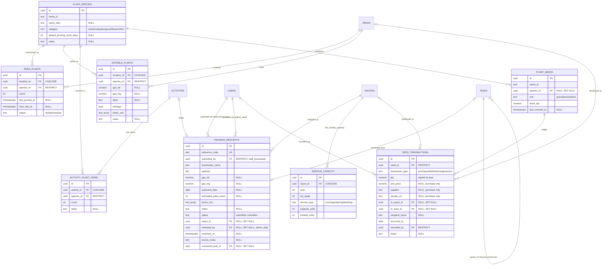

### Modified Entities (Phase 3)

| Entity | New Columns | Changes |
|--------|-------------|---------|
| ACTIVITIES | `custom_fields` JSONB, `photo_before_url` TEXT, `photo_after_url` TEXT, `reference_code` TEXT UNIQUE, `pruning_request_id` UUID FK | New relations to `activity_plant_items` and `pruning_requests`; supports CSV backfill via `reference_code` |
| TASKS | `task_type` TEXT, `custom_fields` JSONB, `parent_task_id` UUID FK→tasks, `target_plant_count` INT, `completed_plant_count` INT | Self-referential parent/child linkage for resume-tomorrow; typed task registry (ADR-031) |
| USERS.role | Enum adds `staff_kecamatan` | ADR-033; `admin_data` unchanged at schema level (capability extended via policy per ADR-032) |
| LOCATION_LOGS | (indexes only) | `(user_id, logged_at DESC)`, `(shift_id, logged_at)`, `(user_id, shift_id, logged_at)` |
| USER_TRACKING_STATUS | (indexes only) | `(location_id, updated_at DESC)`, `(is_within_area, location_id)` |

### Updated Table Count

| Phase | Tables | New/Changed |
|-------|--------|-------------|
| Phase 3 (Plants/Monitoring Rebuild) | +8 | +plant_species, +area_plants, +notable_plants, +activity_plant_items, +pruning_requests, +service_capacity, +plant_seeds, +seed_transactions |
| **Total** | **30** | Up from 22 in Phase 2E |

---

**Last Updated:** 2026-04-24
**ERD Version:** 6.0 (Phase 3 — Plants Management + Monitoring Rebuild + Public Intake Planned)
**Database:** PostgreSQL 14+
