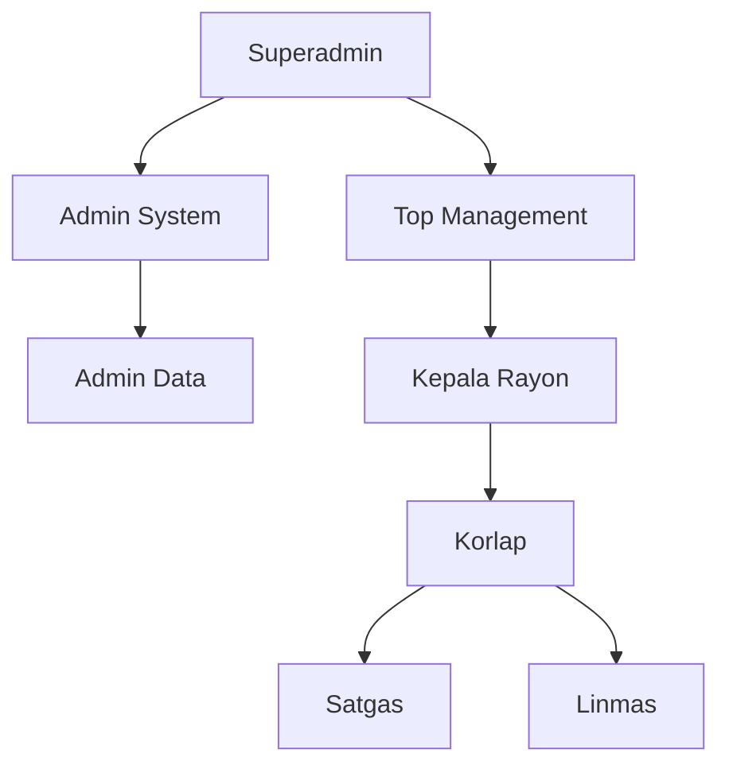
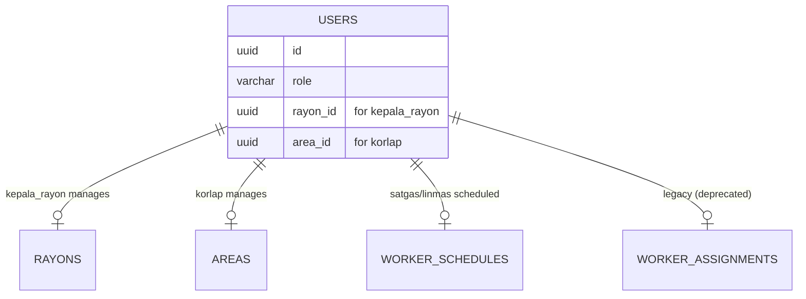
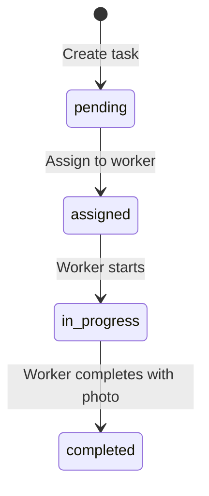
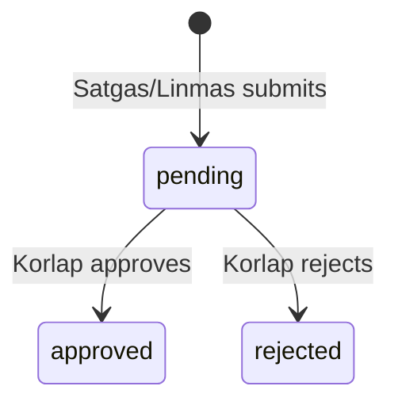
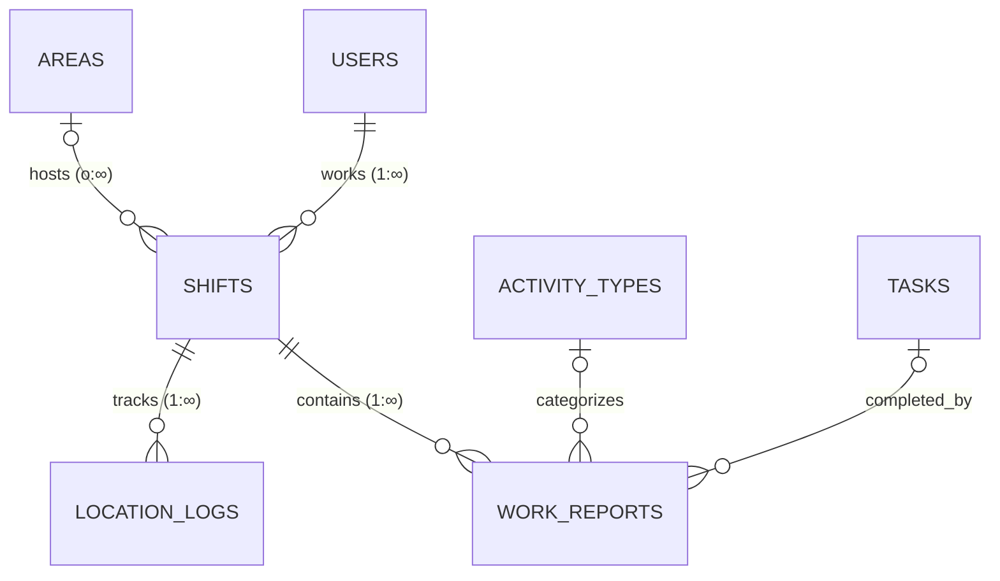
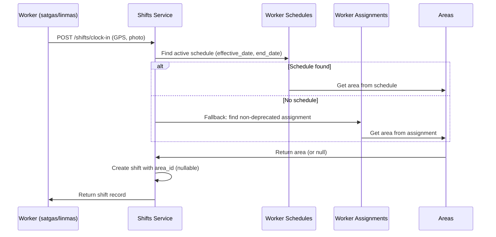
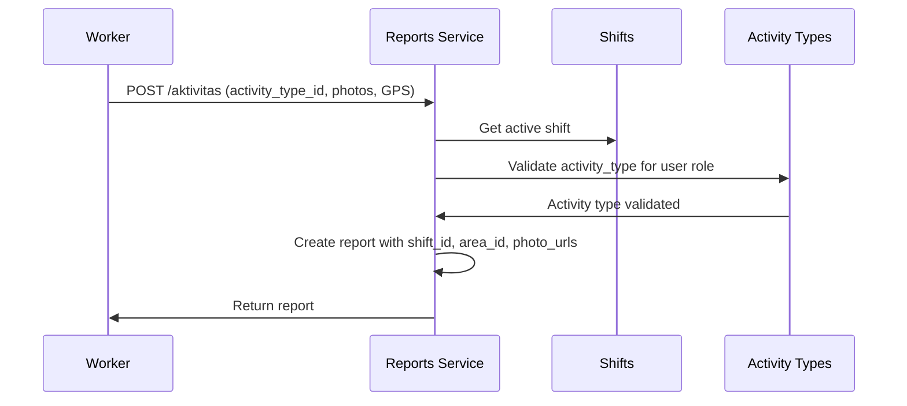
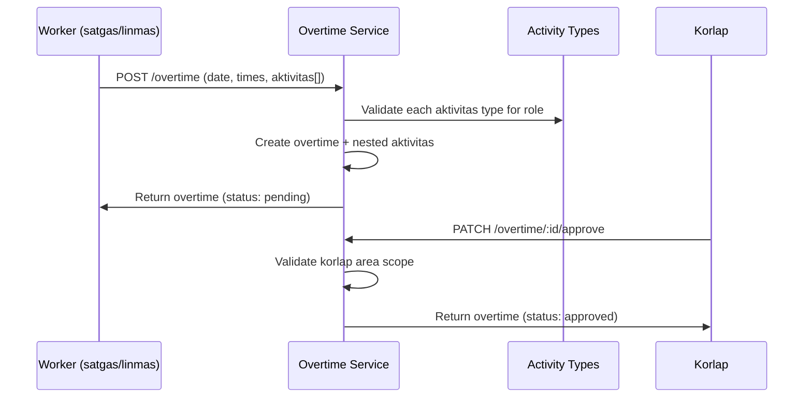

# Entity Relationship Diagram (ERD)

## Overview

This document provides comprehensive Entity Relationship Diagrams for the SEKAR database schema, updated to reflect **Phase 2C (Client Feedback)** changes including the 8-role system, overtime module, task tags, and schema modifications.

**Notation:**
- `1` = One (exactly one)
- `∞` = Many (zero or more)
- `1..1` = One-to-One
- `1..∞` = One-to-Many
- `∞..∞` = Many-to-Many
- `||` = Mandatory (NOT NULL)
- `o|` = Optional (NULL allowed)

---

## Complete ERD (All Tables — Phase 2C)

```mermaid
erDiagram
    RAYONS ||--o{ AREAS : "contains"
    RAYONS ||--o{ USERS : "manages"
    RAYONS ||--o{ TASKS : "scoped_to"

    USERS ||--o{ WORKER_ASSIGNMENTS : "has_one"
    USERS ||--o{ WORKER_SCHEDULES : "scheduled"
    USERS ||--o{ SHIFTS : "works"
    USERS ||--o{ WORK_REPORTS : "creates"
    USERS ||--o{ LOCATION_LOGS : "sends"
    USERS ||--o{ TASKS : "assigned_to"
    USERS ||--o{ TASKS : "created_by"
    USERS ||--o{ TASK_TAGS : "tagged_in"
    USERS ||--o{ OVERTIMES : "submits"
    USERS ||--o{ NOTIFICATIONS : "receives"

    AREA_TYPES ||--o{ AREAS : "categorizes"

    AREAS ||--o{ WORKER_ASSIGNMENTS : "receives"
    AREAS ||--o{ WORKER_SCHEDULES : "scheduled_at"
    AREAS ||--o{ SHIFTS : "location_for"
    AREAS ||--o{ WORK_REPORTS : "report_at"
    AREAS ||--o{ TASKS : "scoped_to"
    AREAS ||--o{ OVERTIMES : "overtime_at"
    AREAS ||--o{ AREA_STAFF_REQUIREMENTS : "requires"
    AREAS o|--|| USERS : "korlap_area"

    SHIFTS ||--o{ WORK_REPORTS : "contains"
    SHIFTS ||--o{ LOCATION_LOGS : "tracks"

    SHIFT_DEFINITIONS ||--o{ WORKER_SCHEDULES : "defines"
    SHIFT_DEFINITIONS ||--o{ AREA_STAFF_REQUIREMENTS : "for_shift"

    TASKS ||--o{ TASK_TAGS : "has_tags"
    TASKS ||--o{ WORK_REPORTS : "completed_by"

    ACTIVITY_TYPES ||--o{ WORK_REPORTS : "categorizes"
    ACTIVITY_TYPES ||--o{ OVERTIME_AKTIVITAS : "categorizes"

    OVERTIMES ||--o{ OVERTIME_AKTIVITAS : "contains"

    USERS {
        uuid id PK
        varchar username UK "NOT NULL, UNIQUE"
        varchar password_hash "NOT NULL"
        varchar full_name "NOT NULL"
        varchar phone "NULL"
        varchar role "NOT NULL, 8-role enum"
        uuid rayon_id FK "NULL, for kepala_rayon"
        uuid area_id FK "NULL, for korlap"
        boolean is_active "DEFAULT true"
        timestamptz created_at
        timestamptz updated_at
        timestamptz deleted_at "NULL, soft delete"
    }

    RAYONS {
        uuid id PK
        varchar name UK "NOT NULL"
        varchar code UK "NOT NULL"
        text description "NULL"
        timestamptz created_at
        timestamptz updated_at
    }

    AREA_TYPES {
        uuid id PK
        varchar code UK "NOT NULL"
        varchar name "NOT NULL"
        text description "NULL"
        varchar category "ACTIVE or PASSIVE"
        timestamptz created_at
        timestamptz updated_at
        timestamptz deleted_at "NULL"
    }

    AREAS {
        uuid id PK
        varchar name "NOT NULL"
        uuid area_type_id FK "NOT NULL"
        uuid rayon_id FK "NULL"
        decimal gps_lat "NOT NULL"
        decimal gps_lng "NOT NULL"
        integer radius_meters "DEFAULT 100"
        text address "NULL"
        jsonb boundary_polygon "NULL"
        decimal coverage_area "NULL"
        boolean is_active "DEFAULT true"
        timestamptz created_at
        timestamptz updated_at
        timestamptz deleted_at "NULL"
    }

    WORKER_ASSIGNMENTS {
        uuid id PK
        uuid worker_id FK "NOT NULL, UNIQUE"
        uuid area_id FK "NOT NULL"
        timestamptz assigned_at
        boolean deprecated "DEFAULT false"
        uuid migrated_to_schedule_id "NULL"
    }

    WORKER_SCHEDULES {
        uuid id PK
        uuid user_id FK "NOT NULL"
        uuid area_id FK "NOT NULL"
        uuid shift_definition_id FK "NOT NULL"
        date effective_date "NOT NULL"
        date end_date "NULL"
        uuid created_by FK "NULL"
        timestamptz created_at
        timestamptz updated_at
    }

    SHIFT_DEFINITIONS {
        uuid id PK
        varchar name UK "NOT NULL"
        varchar code UK "NOT NULL"
        time start_time "NOT NULL"
        time end_time "NOT NULL"
        boolean crosses_midnight "DEFAULT false"
        boolean is_active "DEFAULT true"
        timestamptz created_at
        timestamptz updated_at
    }

    SHIFTS {
        uuid id PK
        uuid worker_id FK "NOT NULL"
        uuid area_id FK "NULL, auto-detected"
        timestamptz clock_in_time "NOT NULL"
        decimal clock_in_gps_lat "NULL"
        decimal clock_in_gps_lng "NULL"
        text clock_in_photo_url "NULL"
        timestamptz clock_out_time "NULL"
        decimal clock_out_gps_lat "NULL"
        decimal clock_out_gps_lng "NULL"
        text clock_out_photo_url "NULL"
        timestamptz created_at
        timestamptz updated_at
        timestamptz deleted_at "NULL"
    }

    WORK_REPORTS {
        uuid id PK
        uuid worker_id FK "NOT NULL"
        uuid shift_id FK "NOT NULL"
        uuid area_id FK "NULL"
        uuid task_id FK "NULL"
        uuid activity_type_id FK "NULL"
        varchar report_type "NULL"
        text description "NOT NULL"
        text_array photo_urls "NOT NULL, 1-3 URLs"
        text photo_url "NULL, legacy"
        decimal gps_lat "NULL"
        decimal gps_lng "NULL"
        timestamptz created_at
        timestamptz updated_at
        timestamptz deleted_at "NULL"
    }

    ACTIVITY_TYPES {
        uuid id PK
        varchar name "NOT NULL"
        varchar code UK "NOT NULL"
        text description "NULL"
        text_array applicable_roles "NOT NULL"
        boolean is_active "DEFAULT true"
        timestamptz created_at
        timestamptz updated_at
    }

    TASKS {
        uuid id PK
        varchar title "NOT NULL"
        text description "NULL"
        varchar status "pending/assigned/in_progress/completed"
        varchar priority "low/medium/high/urgent"
        timestamptz deadline "NULL"
        uuid area_id FK "NULL"
        uuid rayon_id FK "NULL"
        uuid assigned_to FK "NULL"
        uuid created_by FK "NOT NULL"
        varchar completion_photo_url "NULL"
        text completion_notes "NULL"
        timestamptz completed_at "NULL"
        timestamptz assigned_at "NULL"
        timestamptz started_at "NULL"
        timestamptz created_at
        timestamptz updated_at
        timestamptz deleted_at "NULL"
    }

    TASK_TAGS {
        uuid id PK
        uuid task_id FK "NOT NULL"
        uuid user_id FK "NOT NULL"
        timestamptz created_at
    }

    OVERTIMES {
        uuid id PK
        uuid user_id FK "NOT NULL"
        uuid area_id FK "NULL"
        date date "NOT NULL"
        time start_time "NOT NULL"
        time end_time "NOT NULL"
        varchar status "pending/approved/rejected"
        uuid approved_by FK "NULL"
        timestamptz approved_at "NULL"
        text rejection_reason "NULL"
        text notes "NULL"
        timestamptz created_at
        timestamptz updated_at
    }

    OVERTIME_AKTIVITAS {
        uuid id PK
        uuid overtime_id FK "NOT NULL"
        uuid activity_type_id FK "NOT NULL"
        text description "NOT NULL"
        text_array photo_urls "NOT NULL, 1-3 URLs"
        decimal gps_lat "NULL"
        decimal gps_lng "NULL"
        timestamptz created_at
    }

    LOCATION_LOGS {
        uuid id PK
        uuid worker_id FK "NOT NULL"
        uuid shift_id FK "NOT NULL"
        decimal gps_lat "NOT NULL"
        decimal gps_lng "NOT NULL"
        decimal accuracy_meters "NULL"
        integer battery_level "NULL"
        timestamptz logged_at "NOT NULL"
    }

    AREA_STAFF_REQUIREMENTS {
        uuid id PK
        uuid area_id FK "NOT NULL"
        uuid shift_definition_id FK "NOT NULL"
        varchar role "NOT NULL"
        integer required_count "DEFAULT 1"
        varchar day_type "WEEKDAY/WEEKEND/HOLIDAY"
        timestamptz created_at
        timestamptz updated_at
    }

    NOTIFICATIONS {
        uuid id PK
        uuid user_id FK "NOT NULL"
        varchar title "NOT NULL"
        text body "NOT NULL"
        varchar type "NOT NULL"
        jsonb data "NULL"
        timestamptz read_at "NULL"
        timestamptz sent_at
        timestamptz created_at
    }

    NOTIFICATION_TOKENS {
        uuid id PK
        uuid user_id FK "NOT NULL"
        text token "NOT NULL"
        varchar platform "NOT NULL"
        varchar device_id "NULL"
        timestamptz created_at
        timestamptz updated_at
    }

    SPECIAL_DAY_OVERRIDES {
        uuid id PK
        date date UK "NOT NULL"
        varchar day_type "NOT NULL"
        varchar name "NULL"
        text description "NULL"
        timestamptz created_at
        timestamptz updated_at
    }
```



---

## Role System (Phase 2C — 8 Roles)



| Role | Enum Value | Scope | Description |
|------|-----------|-------|-------------|
| Superadmin | `superadmin` | System-wide | Full system access |
| Admin System | `admin_system` | System-wide | System administration |
| Admin Data | `admin_data` | System-wide | Data management |
| Top Management | `top_management` | City-wide | City-wide dashboards |
| Kepala Rayon | `kepala_rayon` | 1 Rayon | Rayon management (via rayon_id) |
| Korlap | `korlap` | 1 Area | Area coordination (via area_id) |
| Satgas | `satgas` | Assigned area | Field worker |
| Linmas | `linmas` | Assigned area | Security officer |

---

## Core Relationships

### User Assignments



**Assignment Rules:**
- **kepala_rayon** → assigned via `users.rayon_id`
- **korlap** → assigned via `users.area_id`
- **satgas/linmas** → assigned via `worker_schedules` (primary) or `worker_assignments` (deprecated fallback)

---

### Task Workflow



**Task Relationships:**
- Task → Area (nullable for rayon-scoped)
- Task → Rayon (nullable for area-scoped)
- Task → User (assigned_to, created_by)
- Task → TaskTag (1:∞, CC-like tagging)

---

### Overtime Workflow



**Overtime Relationships:**
- Overtime → User (submitter, CASCADE)
- Overtime → Area (nullable, SET NULL)
- Overtime → User (approver, nullable)
- Overtime → OvertimeAktivitas (1:∞, CASCADE)
- OvertimeAktivitas → ActivityType

---

### Shift & Reports Flow



**Phase 2C Changes:**
- `shifts.area_id` is now **nullable** (auto-detected from WorkerSchedule → WorkerAssignment fallback)
- `work_reports.photo_urls` TEXT[] replaces single `photo_url` (1-3 photos)
- `work_reports.gps_lat/gps_lng` are now **nullable**
- `work_reports.activity_type_id` links to `activity_types` for role-based validation

---

## Cardinality Summary Table

| Relationship | Parent | Child | Type | Constraint | Notes |
|-------------|--------|-------|------|------------|-------|
| Rayon-Area | rayons | areas | 1:∞ | FK(rayon_id) | 7 rayons, many areas each |
| Rayon-User | rayons | users | 1:∞ | FK(rayon_id) | kepala_rayon role |
| Rayon-Task | rayons | tasks | 1:∞ | FK(rayon_id) | Rayon-scoped tasks |
| AreaType-Area | area_types | areas | 1:∞ | FK(area_type_id) | ACTIVE/PASSIVE category |
| Area-User | areas | users | 1:∞ | FK(area_id) | korlap role |
| User-Assignment | users | worker_assignments | 1:1 | UNIQUE(worker_id) | Deprecated |
| User-Schedule | users | worker_schedules | 1:∞ | FK(user_id) | Primary assignment |
| Area-Schedule | areas | worker_schedules | 1:∞ | FK(area_id) | Schedule location |
| ShiftDef-Schedule | shift_definitions | worker_schedules | 1:∞ | FK(shift_definition_id) | Schedule timing |
| User-Shift | users | shifts | 1:∞ | FK(worker_id) | Work shifts |
| Area-Shift | areas | shifts | o:∞ | FK(area_id) | Nullable in Phase 2C |
| Shift-Report | shifts | work_reports | 1:∞ | FK(shift_id) | Activity reports |
| Shift-Location | shifts | location_logs | 1:∞ | FK(shift_id) | GPS tracking |
| User-Report | users | work_reports | 1:∞ | FK(worker_id) | Denormalized |
| ActivityType-Report | activity_types | work_reports | o:∞ | FK(activity_type_id) | Role-validated |
| Task-Report | tasks | work_reports | o:∞ | FK(task_id) | Task completion |
| User-Task (assigned) | users | tasks | o:∞ | FK(assigned_to) | Assignment |
| User-Task (created) | users | tasks | 1:∞ | FK(created_by) | Creator |
| Area-Task | areas | tasks | o:∞ | FK(area_id) | Nullable for rayon-scoped |
| Task-TaskTag | tasks | task_tags | 1:∞ | FK(task_id) CASCADE | CC-like tagging |
| User-TaskTag | users | task_tags | 1:∞ | FK(user_id) CASCADE | Tagged users |
| User-Overtime | users | overtimes | 1:∞ | FK(user_id) CASCADE | Submissions |
| Area-Overtime | areas | overtimes | o:∞ | FK(area_id) SET NULL | Location |
| Overtime-Aktivitas | overtimes | overtime_aktivitas | 1:∞ | FK(overtime_id) CASCADE | Activities |
| ActivityType-OvAkt | activity_types | overtime_aktivitas | 1:∞ | FK(activity_type_id) | Categorization |
| User-Notification | users | notifications | 1:∞ | FK(user_id) CASCADE | Alerts |
| User-NotifToken | users | notification_tokens | 1:∞ | FK(user_id) CASCADE | Devices |
| ShiftDef-StaffReq | shift_definitions | area_staff_requirements | 1:∞ | FK(shift_definition_id) | Requirements |
| Area-StaffReq | areas | area_staff_requirements | 1:∞ | FK(area_id) CASCADE | Requirements |

---

## Foreign Key Cascade Rules

| FK | ON DELETE | Rationale |
|----|----------|-----------|
| users.rayon_id | SET NULL | User persists if rayon deleted |
| users.area_id | SET NULL | User persists if area deleted |
| worker_assignments.worker_id | RESTRICT | Prevent deletion of assigned worker |
| worker_assignments.area_id | RESTRICT | Prevent deletion of area with assignments |
| worker_schedules.user_id | CASCADE | Remove schedules when user deleted |
| worker_schedules.area_id | CASCADE | Remove schedules when area deleted |
| shifts.worker_id | RESTRICT | Preserve shift history |
| shifts.area_id | RESTRICT | Preserve shift history |
| work_reports.worker_id | RESTRICT | Preserve report history |
| work_reports.shift_id | RESTRICT | Preserve report history |
| work_reports.task_id | SET NULL | Report persists if task deleted |
| work_reports.activity_type_id | SET NULL | Report persists if type deleted |
| tasks.assigned_to | SET NULL | Task persists if user deleted |
| tasks.created_by | RESTRICT | Preserve creator reference |
| tasks.area_id | RESTRICT | Prevent deletion of area with tasks |
| task_tags.task_id | CASCADE | Remove tags when task deleted |
| task_tags.user_id | CASCADE | Remove tags when user deleted |
| overtimes.user_id | CASCADE | Remove overtime when user deleted |
| overtimes.area_id | SET NULL | Overtime persists if area deleted |
| overtime_aktivitas.overtime_id | CASCADE | Remove aktivitas when overtime deleted |
| notifications.user_id | CASCADE | Remove notifications when user deleted |
| notification_tokens.user_id | CASCADE | Remove tokens when user deleted |

---

## Unique Constraints

| Table | Constraint | Columns |
|-------|-----------|---------|
| users | uq_users_username | username (WHERE deleted_at IS NULL) |
| rayons | uq_rayons_name | name |
| rayons | uq_rayons_code | code |
| area_types | uq_area_types_code | code |
| shift_definitions | uq_shift_definitions_code | code |
| shift_definitions | uq_shift_definitions_name | name |
| activity_types | uq_activity_types_code | code |
| worker_assignments | uq_worker_assignments_worker | worker_id |
| worker_schedules | uq_worker_schedule_overlap | (user_id, effective_date, shift_definition_id) |
| task_tags | uq_task_tags_task_user | (task_id, user_id) |
| notification_tokens | uq_notification_tokens_user_token | (user_id, token) |
| special_day_overrides | uq_special_day_date | date |
| area_staff_requirements | uq_area_staff_requirements | (area_id, shift_definition_id, role, day_type) |

---

## Check Constraints

```sql
-- users.role (Phase 2C: 8 roles)
CHECK (role IN ('satgas', 'linmas', 'korlap', 'admin_data',
                'kepala_rayon', 'top_management', 'admin_system', 'superadmin'))

-- tasks.status (Phase 2C: 4 statuses, simplified from 6)
CHECK (status IN ('pending', 'assigned', 'in_progress', 'completed'))

-- tasks.priority
CHECK (priority IN ('low', 'medium', 'high', 'urgent'))

-- overtimes.status
CHECK (status IN ('pending', 'approved', 'rejected'))

-- area_types.category
CHECK (category IN ('ACTIVE', 'PASSIVE'))

-- area_staff_requirements.day_type
CHECK (day_type IN ('WEEKDAY', 'WEEKEND', 'HOLIDAY'))

-- GPS coordinates
CHECK (gps_lat BETWEEN -90 AND 90)
CHECK (gps_lng BETWEEN -180 AND 180)

-- battery_level
CHECK (battery_level BETWEEN 0 AND 100)
```

---

## Data Flow Examples

### Clock-In Flow (Phase 2C)



### Aktivitas Report Flow (Phase 2C)



### Overtime Submission Flow



---

## Table Count Summary

| Phase | Tables | New in Phase |
|-------|--------|-------------|
| Phase 1 (Core) | 7 | users, area_types, areas, worker_assignments, shifts, work_reports, location_logs |
| Phase 2A (Rayons) | 5 | rayons, shift_definitions, worker_schedules, area_staff_requirements, special_day_overrides |
| Phase 2B (Tasks) | 3 | tasks, notifications, notification_tokens |
| Phase 2C (Feedback) | 3 | task_tags, overtimes, overtime_aktivitas |
| **Total** | **18** | |

---

**Last Updated:** 2026-02-11
**ERD Version:** 3.0 (Phase 2C — Client Feedback)
**Database:** PostgreSQL 14+
