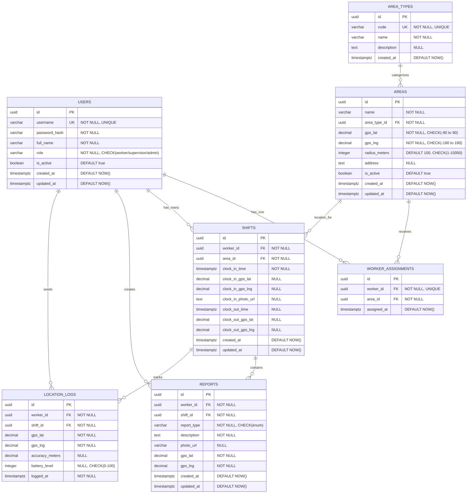
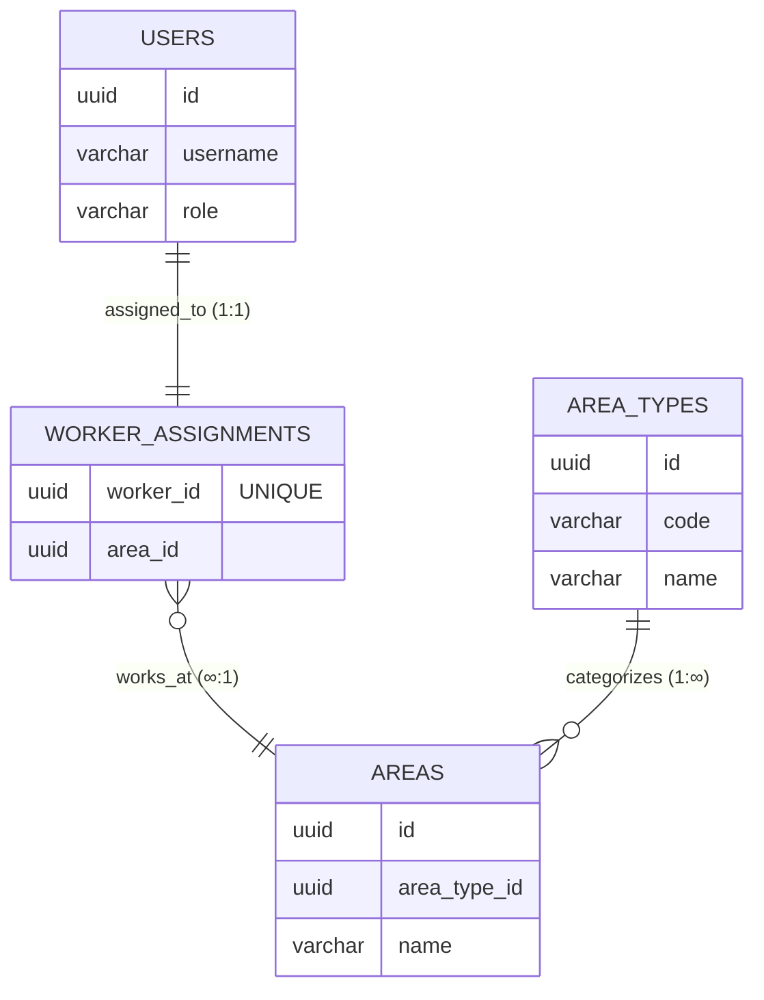
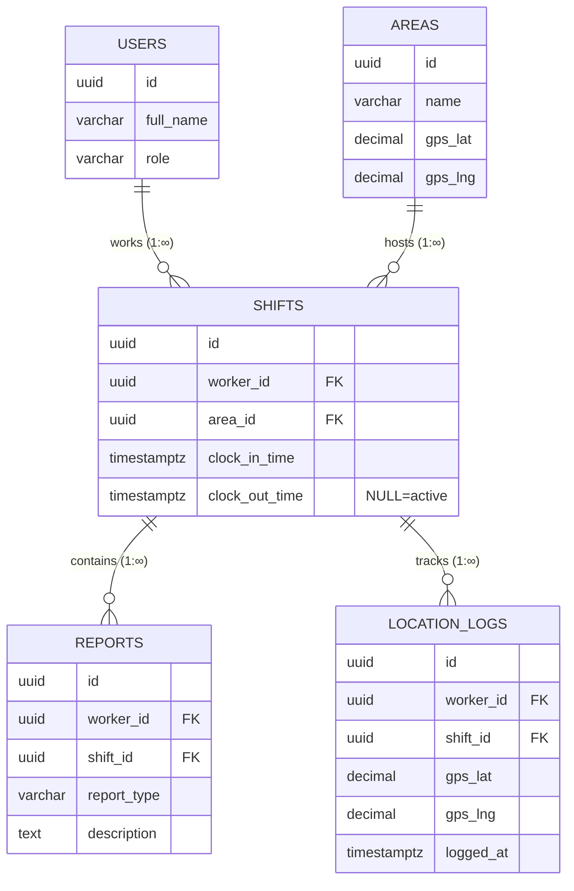
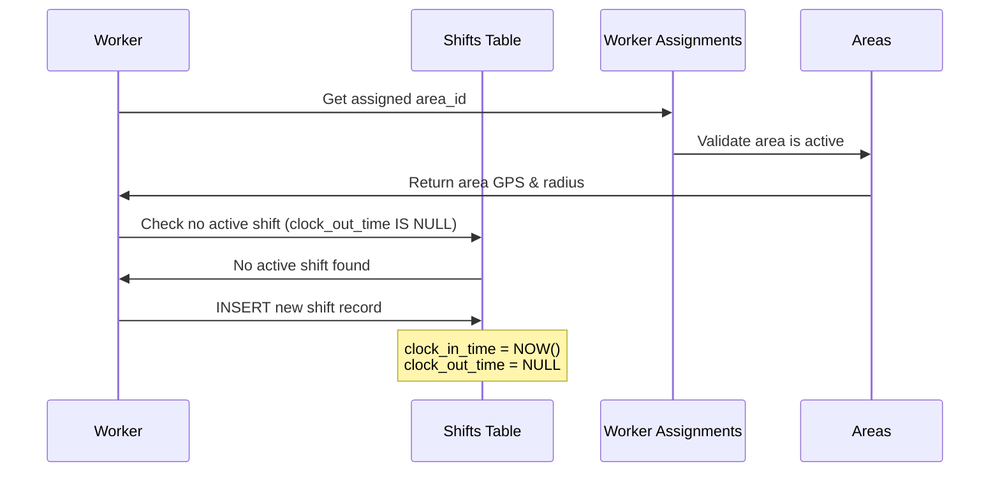
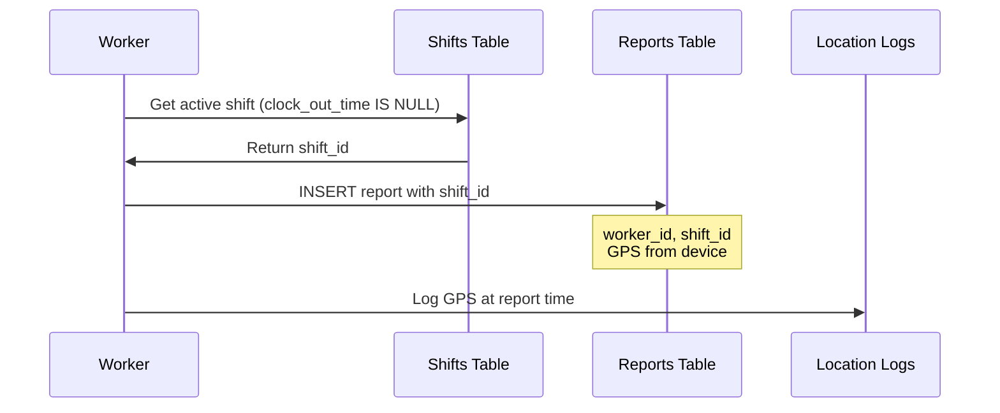
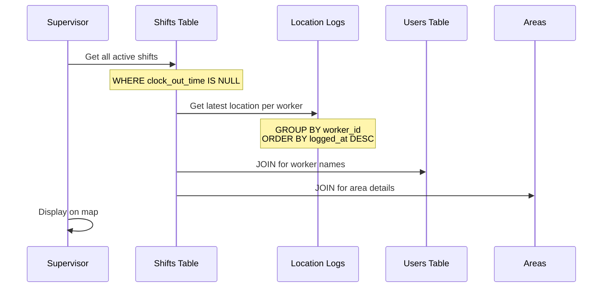

# Entity Relationship Diagram (ERD)

## Overview

This document provides comprehensive Entity Relationship Diagrams for the SEKAR database schema. The diagrams show all tables, relationships, cardinalities, and key constraints.

**Notation:**
- `1` = One (exactly one)
- `∞` = Many (zero or more)
- `1..1` = One-to-One
- `1..∞` = One-to-Many
- `∞..∞` = Many-to-Many
- `||` = Mandatory (NOT NULL)
- `o|` = Optional (NULL allowed)

---

## Complete ERD (All Tables)



---

## Core Relationships Diagram

Focus on the primary relationships between users, areas, and assignments.



**Cardinalities:**
- **USERS ↔ WORKER_ASSIGNMENTS**: 1:1 (One worker has one assignment)
- **WORKER_ASSIGNMENTS ↔ AREAS**: ∞:1 (Many assignments to one area)
- **AREA_TYPES ↔ AREAS**: 1:∞ (One type has many areas)

---

## Shift and Tracking Diagram

Focus on shift lifecycle and associated tracking data.



**Cardinalities:**
- **USERS ↔ SHIFTS**: 1:∞ (One worker has many shifts)
- **AREAS ↔ SHIFTS**: 1:∞ (One area hosts many shifts)
- **SHIFTS ↔ REPORTS**: 1:∞ (One shift has many reports)
- **SHIFTS ↔ LOCATION_LOGS**: 1:∞ (One shift has many location logs)

---

## Detailed Relationship Specifications

### 1. Users → Worker Assignments (1:1)

```
users (1) ──── (1) worker_assignments
  id      ────   worker_id [UNIQUE]
```

**Relationship Type:** One-to-One (enforced by UNIQUE constraint)

**Details:**
- One worker (user with role='worker') can have exactly ONE assignment
- One assignment belongs to exactly ONE worker
- UNIQUE constraint on `worker_assignments.worker_id` enforces 1:1
- To reassign worker: DELETE old assignment, INSERT new one

**SQL:**
```sql
ALTER TABLE worker_assignments
  ADD CONSTRAINT uq_worker_assignments_worker UNIQUE (worker_id);

ALTER TABLE worker_assignments
  ADD CONSTRAINT fk_worker_assignments_worker
  FOREIGN KEY (worker_id) REFERENCES users(id);
```

**Business Logic:**
- Validated in application: Only users with `role='worker'` can be assigned
- Supervisors and admins cannot have assignments

---

### 2. Areas → Worker Assignments (1:∞)

```
areas (1) ──── (∞) worker_assignments
  id    ────     area_id
```

**Relationship Type:** One-to-Many

**Details:**
- One area can have MANY worker assignments (multiple workers)
- Each assignment belongs to exactly ONE area
- No constraint on number of workers per area

**SQL:**
```sql
ALTER TABLE worker_assignments
  ADD CONSTRAINT fk_worker_assignments_area
  FOREIGN KEY (area_id) REFERENCES areas(id);
```

**Business Logic:**
- Only active areas (`is_active = true`) can receive new assignments
- Inactive areas keep existing assignments but no new ones

---

### 3. Area Types → Areas (1:∞)

```
area_types (1) ──── (∞) areas
    id     ────    area_type_id
```

**Relationship Type:** One-to-Many

**Details:**
- One area type (e.g., 'park') can categorize MANY areas
- Each area belongs to exactly ONE area type
- Area type is required (NOT NULL)

**SQL:**
```sql
ALTER TABLE areas
  ADD CONSTRAINT fk_areas_area_type
  FOREIGN KEY (area_type_id) REFERENCES area_types(id);
```

**Business Logic:**
- Area types are master data (seeded, rarely changes)
- Cannot delete area type if referenced by areas
- TypeORM eager loading: Area entity always loads area_type

---

### 4. Users → Shifts (1:∞)

```
users (1) ──── (∞) shifts
  id   ────    worker_id
```

**Relationship Type:** One-to-Many

**Details:**
- One user (worker) can have MANY shifts over time
- Each shift belongs to exactly ONE worker
- Historical record of all shifts

**SQL:**
```sql
ALTER TABLE shifts
  ADD CONSTRAINT fk_shifts_worker
  FOREIGN KEY (worker_id) REFERENCES users(id);
```

**Business Logic:**
- Worker can have only ONE active shift at a time (clock_out_time IS NULL)
- Historical shifts retained indefinitely for audit/payroll

---

### 5. Areas → Shifts (1:∞)

```
areas (1) ──── (∞) shifts
  id   ────    area_id
```

**Relationship Type:** One-to-Many

**Details:**
- One area can have MANY shifts over time
- Each shift occurs at exactly ONE area
- Area at clock-in determines shift location

**SQL:**
```sql
ALTER TABLE shifts
  ADD CONSTRAINT fk_shifts_area
  FOREIGN KEY (area_id) REFERENCES areas(id);
```

**Business Logic:**
- Area_id comes from worker's current assignment
- GPS validation: Worker must be within area boundary to clock in

---

### 6. Shifts → Reports (1:∞)

```
shifts (1) ──── (∞) reports
  id    ────    shift_id
```

**Relationship Type:** One-to-Many

**Details:**
- One shift can have MANY reports (multiple work reports per shift)
- Each report belongs to exactly ONE shift
- Reports can only be created during active shifts

**SQL:**
```sql
ALTER TABLE reports
  ADD CONSTRAINT fk_reports_shift
  FOREIGN KEY (shift_id) REFERENCES shifts(id);
```

**Business Logic:**
- Reports validated against active shift (clock_out_time IS NULL)
- GPS location tagged at report creation
- Workers can edit reports within 30 minutes

---

### 7. Shifts → Location Logs (1:∞)

```
shifts (1) ──── (∞) location_logs
  id    ────    shift_id
```

**Relationship Type:** One-to-Many

**Details:**
- One shift can have MANY location logs (GPS pings every 5-15 minutes)
- Each location log belongs to exactly ONE shift
- High volume relationship (grows quickly)

**SQL:**
```sql
ALTER TABLE location_logs
  ADD CONSTRAINT fk_location_logs_shift
  FOREIGN KEY (shift_id) REFERENCES shifts(id);
```

**Business Logic:**
- Location tracking starts on clock-in, stops on clock-out
- Batch uploads every 30 minutes or 50 pings
- Old logs (>90 days) can be archived

---

### 8. Users → Reports (1:∞)

```
users (1) ──── (∞) reports
  id   ────    worker_id
```

**Relationship Type:** One-to-Many

**Details:**
- One user (worker) can create MANY reports
- Each report belongs to exactly ONE worker
- Redundant with shift_id → worker_id, but kept for direct queries

**SQL:**
```sql
ALTER TABLE reports
  ADD CONSTRAINT fk_reports_worker
  FOREIGN KEY (worker_id) REFERENCES users(id);
```

**Business Logic:**
- Denormalized for query performance (avoid JOIN through shifts)
- Worker can only view/edit their own reports

---

### 9. Users → Location Logs (1:∞)

```
users (1) ──── (∞) location_logs
  id   ────    worker_id
```

**Relationship Type:** One-to-Many

**Details:**
- One user (worker) can have MANY location logs
- Each location log belongs to exactly ONE worker
- Denormalized for performance (latest location query)

**SQL:**
```sql
ALTER TABLE location_logs
  ADD CONSTRAINT fk_location_logs_worker
  FOREIGN KEY (worker_id) REFERENCES users(id);
```

**Business Logic:**
- Denormalized for fast "latest location per worker" queries
- Indexed: (worker_id, logged_at DESC) for performance

---

## Cardinality Summary Table

| Relationship | Parent | Child | Type | Constraint | Notes |
|--------------|--------|-------|------|------------|-------|
| User-Assignment | users | worker_assignments | 1:1 | UNIQUE(worker_id) | One worker, one assignment |
| Area-Assignment | areas | worker_assignments | 1:∞ | FK(area_id) | Many workers per area |
| AreaType-Area | area_types | areas | 1:∞ | FK(area_type_id) | One type, many areas |
| User-Shift | users | shifts | 1:∞ | FK(worker_id) | Many shifts per worker |
| Area-Shift | areas | shifts | 1:∞ | FK(area_id) | Many shifts per area |
| Shift-Report | shifts | reports | 1:∞ | FK(shift_id) | Many reports per shift |
| Shift-Location | shifts | location_logs | 1:∞ | FK(shift_id) | Many logs per shift |
| User-Report | users | reports | 1:∞ | FK(worker_id) | Denormalized for performance |
| User-Location | users | location_logs | 1:∞ | FK(worker_id) | Denormalized for performance |

---

## Foreign Key Cascade Rules

### On Delete Behavior

**No Cascading Deletes** - All handled in application layer:

```sql
-- Example: What happens when a user is deleted?
-- Answer: Deletion is prevented if referenced by other tables

ALTER TABLE worker_assignments
  ADD CONSTRAINT fk_worker_assignments_worker
  FOREIGN KEY (worker_id) REFERENCES users(id)
  ON DELETE RESTRICT;  -- Prevent deletion if assignments exist
```

**Rationale:**
- Preserve data integrity and audit trail
- Use `is_active = false` for soft delete instead
- Explicitly handle deletion in application business logic

### On Update Behavior

**Cascade Updates** - UUID primary keys rarely change:

```sql
-- Example: If a user.id changes (rare), update references
ALTER TABLE worker_assignments
  ADD CONSTRAINT fk_worker_assignments_worker
  FOREIGN KEY (worker_id) REFERENCES users(id)
  ON UPDATE CASCADE;  -- Update references if PK changes
```

**Rationale:**
- UUID primary keys are immutable in practice
- Cascade updates for safety (rarely triggered)

---

## Relationship Constraints

### Unique Constraints

**worker_assignments.worker_id** - Enforces 1:1 relationship
```sql
CONSTRAINT uq_worker_assignments_worker UNIQUE (worker_id)
```

**users.username** - Prevents duplicate usernames
```sql
CONSTRAINT uq_users_username UNIQUE (username)
```

**area_types.code** - Prevents duplicate type codes
```sql
CONSTRAINT uq_area_types_code UNIQUE (code)
```

### Check Constraints

**Validate enum values:**
```sql
-- users.role
CONSTRAINT chk_users_role CHECK (role IN ('worker', 'supervisor', 'admin'))

-- reports.report_type
CONSTRAINT chk_reports_type CHECK (report_type IN ('task_completion', 'incident', 'maintenance_request'))
```

**Validate ranges:**
```sql
-- GPS coordinates
CONSTRAINT chk_areas_gps_lat CHECK (gps_lat BETWEEN -90 AND 90)
CONSTRAINT chk_areas_gps_lng CHECK (gps_lng BETWEEN -180 AND 180)

-- Battery level
CONSTRAINT chk_location_logs_battery CHECK (battery_level BETWEEN 0 AND 100)
```

---

## Indexes for Relationship Queries

### Foreign Key Indexes

All foreign keys have indexes for efficient JOINs:

```sql
-- Worker assignments
CREATE INDEX idx_worker_assignments_worker_id ON worker_assignments(worker_id);
CREATE INDEX idx_worker_assignments_area_id ON worker_assignments(area_id);

-- Areas
CREATE INDEX idx_areas_area_type_id ON areas(area_type_id);

-- Shifts
CREATE INDEX idx_shifts_worker_id ON shifts(worker_id);
CREATE INDEX idx_shifts_area_id ON shifts(area_id);

-- Reports
CREATE INDEX idx_reports_worker_id ON reports(worker_id);
CREATE INDEX idx_reports_shift_id ON reports(shift_id);

-- Location logs
CREATE INDEX idx_location_logs_worker_id ON location_logs(worker_id);
CREATE INDEX idx_location_logs_shift_id ON location_logs(shift_id);
```

### Composite Indexes for Common Queries

```sql
-- Find active shift for worker
CREATE INDEX idx_shifts_active
  ON shifts(worker_id, clock_out_time)
  WHERE clock_out_time IS NULL;

-- Latest location per worker
CREATE INDEX idx_location_logs_worker_time
  ON location_logs(worker_id, logged_at DESC);
```

---

## Data Flow Examples

### Example 1: Clock-In Flow



### Example 2: Report Creation Flow



### Example 3: Supervisor Dashboard Query



---

## Relationship Integrity Rules

### Referential Integrity

1. **No Orphaned Records**
   - All foreign keys must reference existing records
   - ON DELETE RESTRICT prevents orphans

2. **Consistent State**
   - Worker assignments require active areas
   - Reports require active shifts
   - Location logs require active shifts

3. **Data Validation**
   - Application validates role before assignment
   - GPS coordinates validated before clock-in
   - Report types validated against enum

### Transactional Integrity

1. **Clock-In Transaction**
   ```sql
   BEGIN;
     -- Validate no active shift
     -- Insert shift record
     -- Insert first location log
   COMMIT;
   ```

2. **Batch Location Upload**
   ```sql
   BEGIN;
     -- Insert multiple location logs
     -- Update last_ping_time
   COMMIT;
   ```

3. **Worker Reassignment**
   ```sql
   BEGIN;
     -- Delete old assignment
     -- Insert new assignment
   COMMIT;
   ```

---

## Future Enhancements (Phase 2)

### Planned Relationships

1. **Tasks Table**
   - `users (supervisor) → tasks` (1:∞)
   - `tasks → worker_assignments` (∞:∞) - Many-to-Many
   - `tasks → reports` (1:∞) - Task completion

2. **Assets Table**
   - `areas → assets` (1:∞)
   - `reports → assets` (∞:1) - Report about specific asset

3. **Notifications Table**
   - `users → notifications` (1:∞)
   - `shifts → notifications` (1:∞) - Shift-related alerts

4. **Audit Log**
   - All tables → `audit_log` (polymorphic)

---

**Last Updated:** 2026-01-16
**ERD Version:** 1.0 (Phase 1 MVP Complete)
**Database:** PostgreSQL 14+
